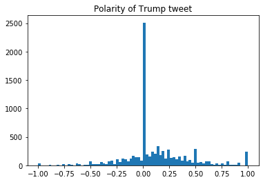
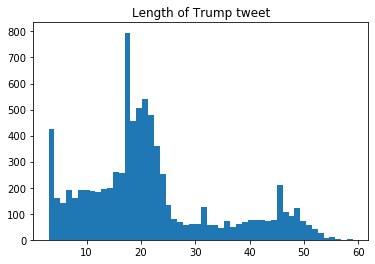
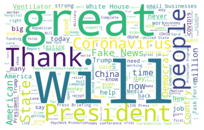
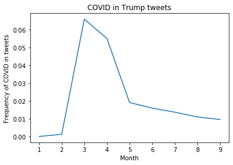
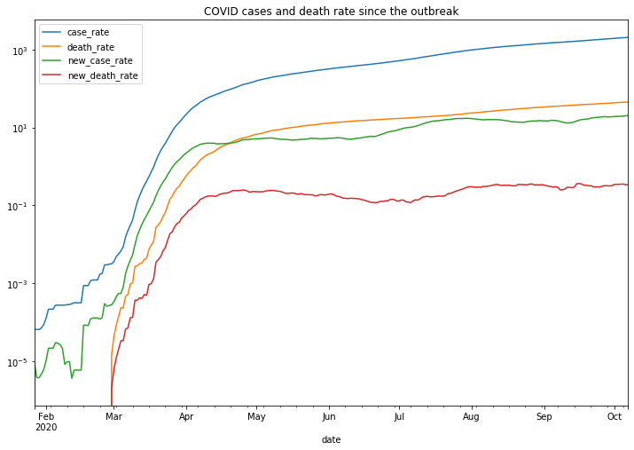
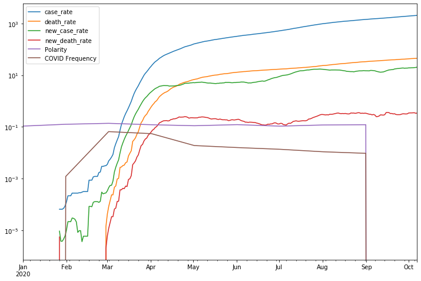

## Intro

President Trump is well known for using Twitter. It is interesting to look inside and see whether there are some correlation between his tweets and the current public health crisis.   
In this project, Trump's tweets data, Covid cases and deaths data in US are analyzed and visualized. More details in jupyter notebook.

## Trump's tweets data
Tweet data of Trump is from Jan 1 2020 to Oct 1 2020, right before he hits COVID-19. Data source: http://www.trumptwitterarchive.com/archive, I find this website so interesting and amazing. I didn't scrape from twitter because sometimes Trumps delete some of his tweets, and this source archives those deleted tweets. Another reason is it takes time to get approval of Twitter developer account.

EDA of Trump's tweets from Jan 1 2020 to Oct 1 2020:    

Most of Trump's tweets are evaluated as neutral, and the rest are slightly more positive. And most of his tweets are short. This is expected since he always seems tough and confident in public.   

### Trump's Favourite words
An example of his word cloud in April. Interactive version available in Jupyter notebook.

### Appearance of "COVID" in Trump's tweets, by month

Trump mentioned "COVID" most in March, but it suddenly drops since May, which may indicate that he is paying much less to public health since then.

## COVID data by county in US
The Covid data comes from https://github.com/OpportunityInsights/EconomicTracker/blob/main/data/COVID%20-%20County%20-%20Daily.csv, containing the daily count and rate per 100,000 people of confirmed COVID-19 cases, deaths or tests performed. The original source is New York Times and The COVID Tracking Project (https://covidtracking.com/). 

The trend of case and death rate, average by county.

The new case and death rate in US is still growing high, with no signals of improvement.

## correlation between COVID Trend and Trump's tweets

From the summary, Trump's tweets remain in a bit positive mood even in such serious crisis. He seems not very affected by the pandemic before he actually infected COVID. His distraction from COVID may comes from the BLM movement and election compainge.
